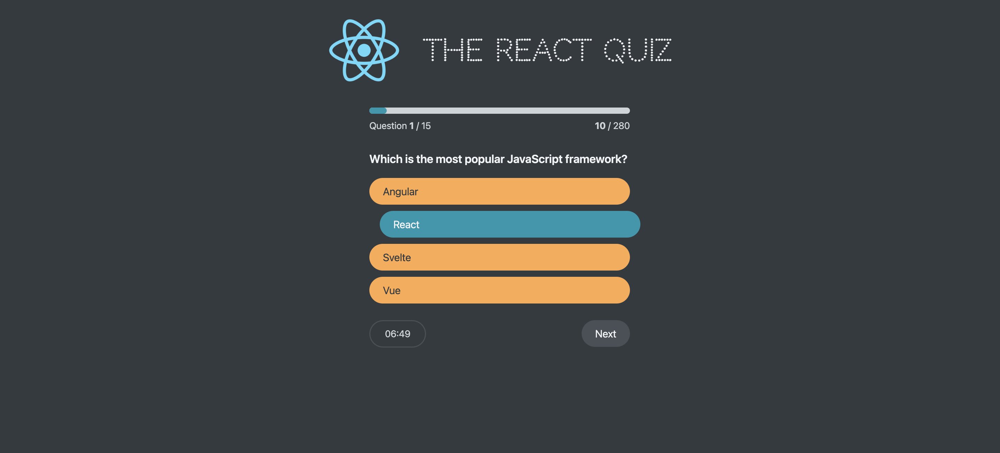

# React Quiz - build with React

This is an interactive quiz web page built using React, designed to help users enhance their knowledge and skills through practicing questions. Key features include:

- Question Bank Management: Questions and answers are stored in a custom JSON file and fetched directly, providing real-time data access.
- Countdown Timer: Upon starting the quiz, a countdown timer automatically begins, ensuring users complete the quiz within the allotted time.
- Real-time Scoring: As users answer each question, the system scores in real-time and displays the current score on the page.
- Progress Display: A progress bar on the page shows the completion status of the quiz, allowing users to see how many questions remain.
- Results Page: When the quiz is completed or the time expires, the system automatically redirects to a results page displaying the user's total score.

  This web page offers an intuitive and user-friendly platform for conducting quizzes, enhancing the interactive experience through real-time feedback and progress tracking. Whether used for learning, practice, or testing, this React quiz web page provides robust support and assistance.

- Screenshot:
  

## Built with

- React

## Runs the app

```Shell
npm start
```

- Runs the app in the development mode.
- Open [http://localhost:3000](http://localhost:3000) to view it in your browser.

- The page will reload when you make changes.
- You may also see any lint errors in the console.

## Links

- Live Site URL: [live site URL here](https://the-react-quiz-time.netlify.app/)

## Author

- The Ultimate React Course 2024: React, Redux & More by Jonas Schmedtmann
- My GitHub - [YACodingroom](https://github.com/YAcodingroom)

## Acknowledgments

- Ivy & Ciao
- YAL me
- Dr.Angela & Jonas
